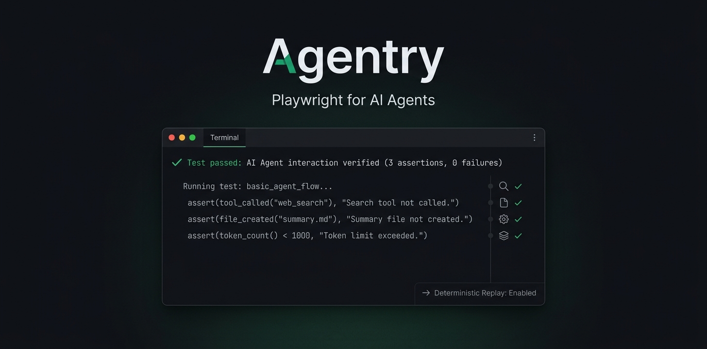

<h1 align="center">
  
</h1>

> **Playwright for AI Agents** — end-to-end testing for the infrastructure AI agents interact with.

**Status:** Early MVP — Claude, Codex, Gemini, and Antigravity drivers; structural assertions; record/replay. No published npm package yet. See [Roadmap](#roadmap).

---

## What it is

Playwright drives a real browser and asserts on the DOM. Agentry drives a real AI agent CLI and asserts on what the agent *did* — which tools it called, what files it created, how many tokens it spent.

You write TypeScript tests that:

1. **Drive a real agent CLI** (Claude Code, Codex, Gemini, or Antigravity — all headless) with a prompt and a sandbox workspace.
2. **Observe a normalized event stream** — assistant turns, tool calls, MCP requests, filesystem side-effects, token usage.
3. **Assert on structure, not text** — `toHaveToolCall`, `toHaveFile`, `toFinishWithin`. Exact matchers on what the agent did; no fragile string matching on free-form output.
4. **Replay deterministically** in CI via recorded transcripts — fast (<2 s), free, no agent required. Record once live; replay forever.

The target is the agent's surrounding ecosystem: skills, MCP gateways, plugins — the things that break when model behavior shifts but your prompt didn't change.

---

## Install / dev setup

There is no published npm package yet. Run from this monorepo directly.

**Prerequisites:** Node >= 20, pnpm >= 10, and the CLI for whichever driver you use in your PATH — `claude` (with `ANTHROPIC_API_KEY`), `codex`, `gemini`, or `agy`, each authenticated per its own vendor. Replay-only runs need none of these.

```bash
git clone <this repo>
cd agentry
pnpm install
```

All TypeScript is executed directly via `tsx` — no build step required for development. The monorepo root `package.json` exposes a `pnpm agentry` script that invokes `packages/cli/src/bin.ts`.

**Packages:**

| Package | Description |
|---|---|
| `@agentry/core` | Event model, config, sandbox, runner, assertions |
| `@agentry/claude` | Claude Code driver (`claude -p --output-format stream-json`) |
| `@agentry/codex` | Codex CLI driver (`codex exec --json`) |
| `@agentry/gemini` | Gemini CLI driver (`gemini -p --output-format stream-json`) |
| `@agentry/antigravity` | Antigravity driver (`agy -p --output-format stream-json`) |
| `@agentry/mcp` | `MockMcpServer` (JSON-RPC + stdio shim) + MCP matchers |
| `agentry` | CLI (`agentry test`, `record`, `init`, `doctor`) |

---

## Quick start

The `examples/basic` directory contains a working example with a committed transcript — replay works without an API key.

### 1. Config: `examples/basic/agentry.config.ts`

```ts
import { defineConfig } from 'agentry-test';

export default defineConfig({
  testDir: './tests',
  mode: 'replay', // default; `agentry record` captures, --mode live hits the real agent
  use: { agent: 'claude', model: 'claude-haiku-4-5' },
  budget: { perTest: { usd: 0.25 } },
});
```

`use.agent` selects the driver — `'claude'` (default), `'codex'`, `'gemini'`, or `'antigravity'` — and `use.model` must be a pinned snapshot id for that agent.

### 2. Test: `examples/basic/tests/todo.agentry.ts`

```ts
import { test } from 'agentry-test';

test.describe('todo', () => {
  test('reads the todo file via a tool', async ({ agent, workspace, expect }) => {
    await workspace.write('notes/todo.md', '- buy milk\n- call the bank');

    await agent.run('Read the file notes/todo.md and tell me what is on the list.', {
      allowedTools: ['Read'],
      permissionMode: 'bypassPermissions',
    });

    // Tier 1 — structural (exact, deterministic)
    await expect(agent).toHaveToolCall(/read/i);
    await expect(agent).not.toHaveToolCall(/write|edit/i); // safety deny-list

    // Budget
    await expect(agent).toFinishWithin({ tokens: 80_000 });

    // Tier 2 — side-effect
    await expect(workspace).toHaveFile('notes/todo.md', { containing: 'milk' });
  });
});
```

### 3. Commands

**Check your setup:**
```bash
pnpm agentry doctor
```

**Replay (uses the committed transcript — no API key needed):**
```bash
pnpm agentry test --config examples/basic/agentry.config.ts --dir examples/basic/tests
```

**Record (hits the real Claude CLI, requires `ANTHROPIC_API_KEY`):**
```bash
pnpm agentry record --config examples/basic/agentry.config.ts --dir examples/basic/tests
```

Recorded transcripts are written to `__agentry__/<test-file-name>/` next to the test file and should be committed to the repo for hermetic CI replay.

**Scaffold a new project:**
```bash
pnpm agentry init [dir]
```

---

## Authoring tests

### Fixtures

Tests receive fixtures by name as destructured parameters:

| Fixture | Type | Description |
|---|---|---|
| `agent` | `AgentHandle` | Drives the agent; holds the last run's event stream |
| `workspace` | `Sandbox` | Isolated temp directory; `write`, `read`, `exists`, `list` |
| `mcp` | `RunViewProvider` | Same run view as `agent`; for MCP-specific assertions |
| `expect` | Agentry `expect` | Extended Jest `expect` with all Agentry matchers |

### Running the agent

```ts
await agent.run(prompt, opts);
```

`opts` (all optional): `allowedTools`, `disallowedTools`, `permissionMode`, `mcpConfig`, `appendSystemPrompt`.

### Matchers

All matchers support `.not`. Operate on `expect(agent)` (RunView) or `expect(workspace)` (Sandbox).

| Matcher | Description |
|---|---|
| `toHaveToolCall(name, args?)` | Agent called tool `name` (string or RegExp); `args` is a subset match |
| `toHaveCalledToolTimes(name, n)` | Tool called exactly `n` times |
| `toUseToolsFrom(allowed[])` | Every tool called was in the allow-list |
| `toHaveCalledAll(required[])` | All listed tools were called (order-insensitive) |
| `toHaveMcpRequest({ method?, server?, name? })` | An MCP request matching the filter was made |
| `toFinishWithin({ tokens?, turns? })` | Token and/or turn budget check |
| `toHaveFile(rel, { containing? })` | Sandbox file exists, optionally containing text or RegExp |

```ts
// Tier 1 — structural
await expect(agent).toHaveToolCall('read_file', { path: /todo/ });
await expect(agent).not.toHaveToolCall(/rm|delete/i);
await expect(agent).toHaveCalledAll(['read_file', 'write_file']);
await expect(agent).toUseToolsFrom(['read_file', 'list_dir']);

// Budget
await expect(agent).toFinishWithin({ tokens: 50_000, turns: 5 });

// Tier 2 — side-effect
await expect(workspace).toHaveFile('output/result.md', { containing: /## Summary/ });
await expect(workspace).not.toHaveFile('secrets.txt');

// MCP
await expect(mcp).toHaveMcpRequest({ method: 'tools/call', name: 'read_file' });
```

---

## Run modes

Configured via `mode` in `agentry.config.ts` or `--mode` on the CLI.

| Mode | LLM | Use |
|---|---|---|
| `replay` (default) | Transcript replay — no agent spawned | CI; fast (<2 s), free |
| `wire-replay` | Spawns the real agent against recorded LLM responses (positional VCR) | Hermetic re-execution; $0 real spend |
| `record` | Live agent run; writes transcript + wire cassette | Authoring / re-baselining |
| `live` | Live agent run; no capture | Periodic drift checks |
| `mcp-live` | Live agent run with MCP passthrough | MCP server tests (roadmap) |
| `dry` | No run; skips all scenarios | Lint/validate test files |

**Replay in the MVP** means transcript replay: the normalized event stream recorded during `agentry record` is replayed directly, reconstructing all assertions without spawning the agent. This is distinct from wire-level cassette replay (LLM proxy interception), which is on the roadmap.

---

## How it works

```
Test file  →  runner  →  AgentHandle.run(prompt)
                              │
                    (record)  ClaudeDriver
                              │  spawns: claude -p --output-format stream-json --verbose
                              │  normalizes native events → AgentEvent stream
                              │  captures fs diff (before/after sandbox snapshot)
                              ↓
                          RunRecord  (events + usage + result)
                              │
                         matchers  (toHaveToolCall, toHaveFile, …)
                              │
                    (replay)  ReplayDriver
                              │  reads transcript JSON → reconstructs RunRecord
                              │  no agent spawned; all assertions work identically
```

Key design decisions:

- **Structured/headless substrate.** Every driver uses its CLI's structured headless mode — `claude -p --output-format stream-json --verbose`, `codex exec --json`, `gemini -p --output-format stream-json`, `agy -p --output-format stream-json` — no TTY, no screen scraping. The JSONL stream is the reliable source of truth (the CDP analog).
- **Normalized event model.** Every driver output is translated into the same `AgentEvent` stream (`tool_use`, `tool_result`, `mcp_request`, `message`, `usage`, `run.end`, …). Assertions read only this model; drivers are pluggable.
- **Sandbox isolation.** Each scenario runs in a fresh temp directory. File side-effects are detected by content-hash snapshotting before/after the run, producing `fs` events.
- **Budget cap.** `budget.perTest.usd` is enforced post-run in the MVP; `--max-budget-usd` is passed to the Claude CLI as a native backstop.
- **Transcripts committed to the repo.** Stored as JSON next to the test file under `__agentry__/`. Replay is hermetic and requires no API key.

See [docs/SPEC.md](./docs/SPEC.md) for the full design.

---

## Project layout

```
agentry/
├── packages/
│   ├── core/          @agentry/core — events, config, sandbox, runner, assertions, transcript
│   ├── claude/        @agentry/claude — Claude Code driver
│   ├── codex/         @agentry/codex — Codex CLI driver
│   ├── gemini/        @agentry/gemini — Gemini CLI driver
│   ├── antigravity/   @agentry/antigravity — Antigravity (agy) driver
│   ├── mcp/           @agentry/mcp — MockMcpServer + MCP matchers
│   └── cli/           agentry — CLI binary (test, record, init, doctor)
├── examples/
│   └── basic/       Working example with committed transcript
└── docs/
    ├── SPEC.md      Full design specification
    └── ROADMAP.md   Phased delivery plan and open questions
```

---

## Roadmap

The SPEC describes the full vision. What is implemented vs. planned:

**Implemented**
- Claude driver (`claude -p --output-format stream-json`)
- Codex driver (`codex exec --json`)
- Gemini driver (`gemini -p --output-format stream-json`; coalesces streaming assistant deltas)
- Antigravity driver (`agy -p --output-format stream-json`; event-stream normalization faithful, sandbox fs-diff best-effort since agy uses its own scratch dir)
- Normalized causal event model (`tool_use`, `tool_result`, `mcp_request`, `llm_request`/`llm_response`, `message`, `usage`, `run.end`, `plugin`, `skill`, `fs`)
- Assertions, Tiers 1–3: `toHaveToolCall`, `toHaveCalledToolTimes`, `toUseToolsFrom`, `toHaveCalledAll`, `toHaveMcpRequest`, `toFinishWithin`, `toHaveFile`, `toMatchSchema`
- Skill/plugin effect matchers: `toHaveLoadedPlugin`, `toFireHook` (CH2) and `toInjectContext`, `toRegisterTools` (CH1, via the proxy)
- **LLM interception proxy** (`LlmProxy` at `ANTHROPIC_BASE_URL`): CH1 events, byte-faithful **wire cassettes**, budget proxy-gate, secret redaction, positionable `Upstream` seam
- `MockMcpServer` (JSON-RPC core + stdio shim) + MCP matchers `toExposeTools`, `toHaveReceived`
- Directory sandbox with before/after fs diff
- Transcript record/replay (default) **+ `wire-replay`** (hermetic re-execution, positional VCR)
- `agentry test`/`record`/`init`/`doctor` CLI; config with model-pinning + budget caps; console reporter with cost

**Roadmap (not yet implemented)**

| Item | Phase |
|---|---|
| Skills/plugins CH6 **differential** harness (`toChangeBehaviorVs`) | Phase 2 |
| MCP **live**: agent→mock fixture wiring + protocol-compliance matchers (`toBeValidMcpProtocol`, error codes) | Phase 3 |
| LLM **gateway** matchers (routing/fallback/cache/rate-limit) + provider-pool resolver (foundation shipped) | Phase 4 |
| Cursor driver | Phase 5 (spike-gated) |
| Semantic/LLM-as-judge assertions (Tier 4: `toSatisfyRubric`) | Phase 6 |
| HTML/JUnit/JSON reporters; trace bundles | Phase 6 |
| HOME-remap / container sandbox; commit wire cassettes (host config leakage today) | Phase 7+ |
| Trace viewer UI; `agentry codegen`; PTY/TUI interactive driver | Phase 7+ |

See [docs/ROADMAP.md](./docs/ROADMAP.md) for the full phased plan and open questions.

---

## License

[Apache License 2.0](./LICENSE) © Francis Eytan Dortort
